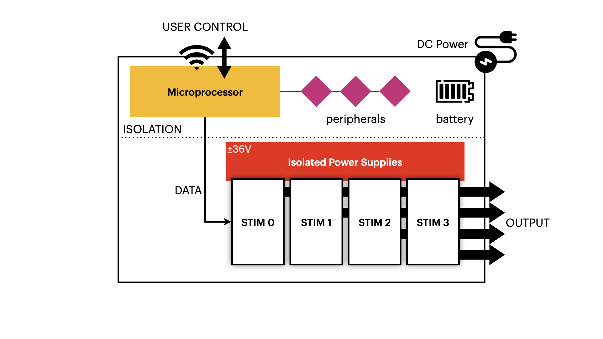
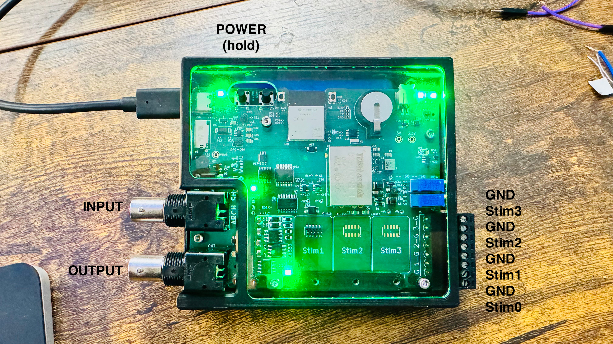

# ArchStimV3 Library

`ArchStimV3` is an Arduino library designed to control and generate complex waveforms with an ADC (ADS1118) and a DAC (AD57X4R). This library allows for the generation of various waveforms and provides utility functions for managing and controlling isolated components.

## Features

- **Waveform Generation**: Square waves, pulse sequences, random pulses, and summed/ramped sine waves
- **Object-Oriented Design**: Extensible waveform class hierarchy
- **Active Waveform Management**: Dynamic waveform switching with proper cleanup
- **Isolated Component Control**: Functions for managing isolated hardware
- **Hardware Integration**: ADC and DAC control with safety features

## Command Sequence

To run a waveform, follow these steps in order:

1. **Enable the stimulator** (required once after startup):
   ```
   EN;
   ```

2. **Set a waveform** (example using square wave):
   ```
   SQR:-500,500,10;
   ```

3. **Set stimulation timeout** (optional):
   ```
   TSTIM:1000;  // 1000ms timeout, use 0 to run forever
   ```

4. **Start the waveform**:
   ```
   START;
   ```

For each new stimulation trial, repeat steps 2-4. The stimulator (EN;) only needs to be enabled once after startup.

You can run commands together, always `;` terminated. For example:

```
SQR:-500,500,10;TSTIM:1000;START;
```

## Hardware





## Requirements

- **Arduino IDE** or compatible development environment
- **ADS1118** ADC library (for analog-to-digital conversion)
- **AD57X4R** DAC library (for digital-to-analog conversion)
- **SD.h, SPI.h, Wire.h** libraries (included with the Arduino IDE)

## Installation

1. Clone or download the `ArchStimV3` library into your Arduino `libraries` folder.
2. Make sure the required dependencies (ADS1118 and AD57X4R) are installed in your Arduino IDE.
3. Restart the Arduino IDE if it was open during installation.

## Pin Configuration

### Input Pins
| Pin Name    | Pin Number | Description             | Default State |
|-------------|------------|-------------------------|---------------|
| USB_SENSE   | 1         | USB power sense         | INPUT        |
| USER_IN     | 2         | User input              | INPUT_PULLUP |
| EXT_INPUT   | 11        | External input          | INPUT        |
| FUEL_ALERT  | 42        | Fuel gauge alert        | INPUT        |

### Output Pins
| Pin Name    | Pin Number | Description             | Default State |
|-------------|------------|-------------------------|---------------|
| LED_R       | 45        | Red status LED          | LOW          |
| LED_B       | 5         | Blue status LED         | -            |
| LED_STIM    | 46        | Stimulation indicator   | LOW          |
| EXT_OUTPUT  | 9         | External output control | LOW          |
| BUZZ        | 10        | Buzzer output           | -            |
| DISABLE     | 41        | Output disable control  | LOW          |
| DRIVE_EN    | 40        | Isolation control       | HIGH*        |

### Communication Pins
| Pin Name    | Pin Number | Description             | Default State |
|-------------|------------|-------------------------|---------------|
| ADC_CS      | 12        | ADC chip select         | HIGH         |
| DAC_CS      | 13        | DAC chip select         | HIGH         |
| SD_CS       | 34        | SD card chip select     | HIGH         |
| MISO        | 37        | SPI MISO                | -            |
| MOSI        | 35        | SPI MOSI                | -            |
| SCK         | 36        | SPI SCK                 | -            |
| SDA_PIN     | 3         | I2C data                | -            |
| SCL_PIN     | 4         | I2C clock               | -            |

\* Set HIGH during initialization via `activateIsolated()`

## Usage

Refer to the `examples/ArchStimExample` for usage examples.


## Command Interpreter

The `CommandInterpreter` class processes serial commands to generate waveforms. It follows a simple syntax pattern:

```
COMMAND:parameters
```

This overview references:

- **System Control**: Device enable/disable, waveform stopping, diagnostic functions, system status checks
- **Waveform Generation**: Basic waveforms (square, pulse), complex patterns (sum of sines, ramped sine), random/stochastic patterns, custom sequences

### Command System Architecture

The command system operates through three distinct layers:

1. **Command Parsing and Validation**
   - Serial command interpretation
   - Format verification
   - Command type identification

2. **Parameter Processing**
   - Type-specific parameter extraction
   - Value range validation
   - Array handling for complex patterns

3. **Waveform Management**
   - Dynamic waveform instantiation
   - Active pattern tracking
   - Memory cleanup

### Safety Features

- **Input Validation**
  - Voltage limit checking
  - Frequency validation
  - Parameter boundary enforcement

- **Resource Management**
  - Dynamic memory allocation tracking
  - Array bounds checking
  - Proper cleanup of inactive waveforms

### Implementation

The system is implemented in `src/CommandInterpreter.h` with supporting waveform classes in `src/Waveforms/`. Each waveform type inherits from a base class that defines common behaviors and interfaces.

For specific implementations, see:

## License

This library is provided under the MIT License. See `LICENSE` for details.